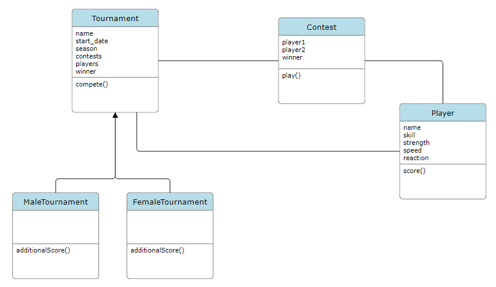

# Tenis Tournament - Challenge

## Aclaraciones varias
- El modelado de las clases está basado en el diseño "puro" de objetos del siguiente diagrama:


Al implementarlo en un framework, implica algunos cambios para aprovechar las herramientas que ofrece el mismo (Laravel en este caso). Se utilizaron interfaces, traits, requests, resources, rules y otras características del framework para implementar el modelo.

- Las características de cada jugador se implementaron como valores enteros entre 1 y 100. A mayor valor, mayor es la habilidad.
- Los jugadores no fueron distinguidos por sexo. Ambos tienen todas las características mencionadas en el enunciado y las consideraciones a la hora de hacer los cálculos fueron tomadas tratando de respetar lo que dice el enunciado. Las principales son:
    - El **TORNEO** puede ser Femenino o Masculino
    - En un **ENFRENTAMIENTO** entre dos jugadores influyen el nivel de habilidad y la suerte
para decidir al ganador del mismo.
    - En el **TORNEO** masculino, se deben considerar la fuerza y la velocidad de desplazamiento como parámetros adicionales al momento de calcular al ganador.
    - En el **TORNEO** femenino, se debe considerar el tiempo de reaccion como un parámetro adicional al momento de calcular al ganador.
- El concepto suerte fue modelado de la siguiente manera:
    - Por cada jugador del encuentro, se suman el nivel y los puntos adicionales.
    - Se calcula la diferencia en puntos entre ambos jugadores, que representa la "habilidad" que le falta al jugador más "débil" para llegar a ganarle al jugador más "fuerte".
    - Se calcula un número random (la suerte) entre 0 y la diferencia que necesita el jugador "débil" para ganar. 
    - Si el nivel + los puntos adicionales + "suerte" es más grande que el puntaje del jugador "fuerte", entonces el ganador es el jugador "débil".

## Configuración entorno local
- Clonar repo
- Copiar archivo .env.example a .env

**La solución funciona con Laravel Sail, por lo que está dockerizada. Los siguientes comandos se ajustan a dicha configuración:**
- Levantar el container:
```
./vendor/bin/sail up
```
- Instalar dependencias:
```
./vendor/bin/sail composer install
./vendor/bin/sail npm install
```
- Generar llaves:
```
./vendor/bin/sail artisan key:generate
./vendor/bin/sail artisan jwt:secret
```
- Crear las tablas de la base de datos:
```
./vendor/bin/sail artisan migrate
```

**Sin contenedores, los comandos son:**
```
composer install
```
```
npm install
```
```
php artisan key:generate
```
```
php artisan jwt:secret
```
Configurar los datos de la base de datos en el archivo .env
```
php artisan migrate
```
```
php artisan serve
```
## PHPUnit
El comando para ejecutar test cases es:
```
./vendor/bin/sail artisan test
```
ó
```
php artisan test
```

## Swagger
La url de swagger es http://localhost/api/documentation